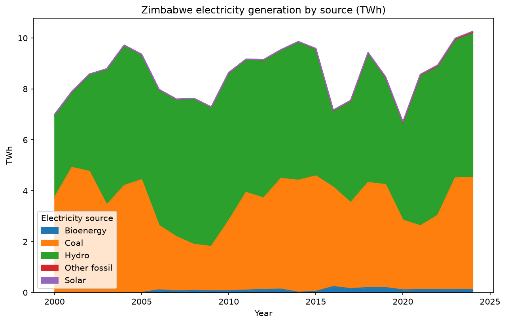
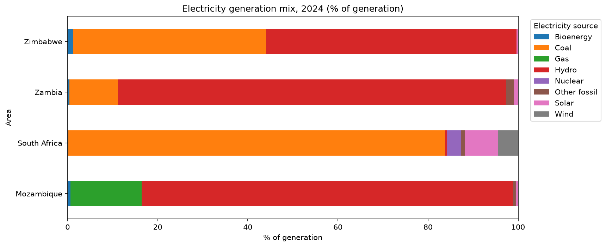

# Zimbabwe's Electricity Mix in Regional Context

## Question
How has Zimbabwe's electricity generation changed since 2000, and how does
its mix compare with South Africa, Zambia and Mozambique?

## Key findings
- Zimbabwe's domestic electricity comes almost entirely from hydro and coal: in 2024, hydro produced about 56% and coal about 43%, while solar was under 1%. Coal generation jumped from 2.9 TWh in 2022 to 4.4 TWh in 2023.
- Among its neighbours, Zimbabwe is the only country with a near-even split between hydro (56%) and coal (43%). Zambia (86%) and Mozambique (82%) rely mainly on hydro, South Africa runs on coal (84%), and South Africa's solar share (7.4%) is about 18 times Zimbabwe's (0.4%).

## Charts

## Data source
| Item | Detail |
|---|---|
| Source | Ember, Yearly Electricity Data |
| Link | https://ember-energy.org/data/yearly-electricity-data/ |
| File used | release_generation_yearly_global.csv |
| Date downloaded | TODAY'S DATE |
| License | CC BY 4.0 |

## Cleaning and validation
- Removed aggregated rows (e.g. "total fossil") to avoid double counting
- Separated net imports from domestic generation
- Dropped sources that are zero in every year
- Checked: no duplicate years, no negative values, no missing values (2000-2024)

## Limitations
- Ember compiles national and international reporting, so small-scale and
  off-grid solar may not be captured. ADD ONE SENTENCE AFTER READING THE
  METHODOLOGY NOTE (link on Ember's data page)
- Shares exclude net imports; Zimbabwe imports about 1.8 TWh a year

## How to reproduce
1. Download the CSV from the link above into `Data/Raw/`
2. Install libraries: `pip install pandas matplotlib`
3. Open `analysis.ipynb` and click Run All

## Author
Charlene Muchechesi, Data Analyst